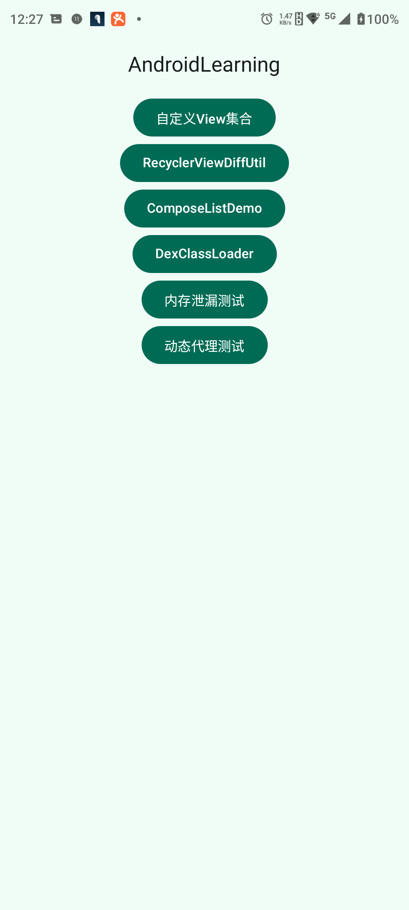
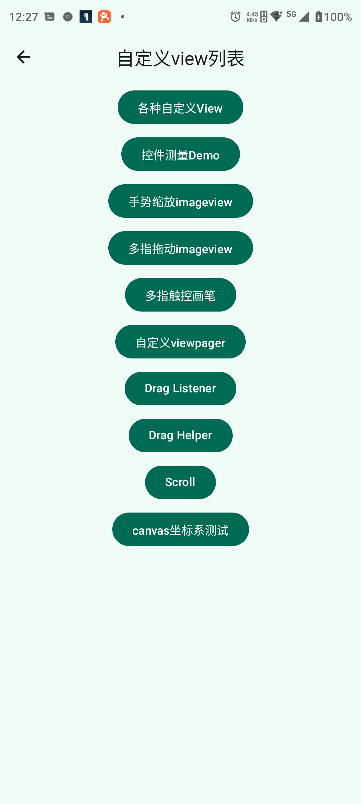
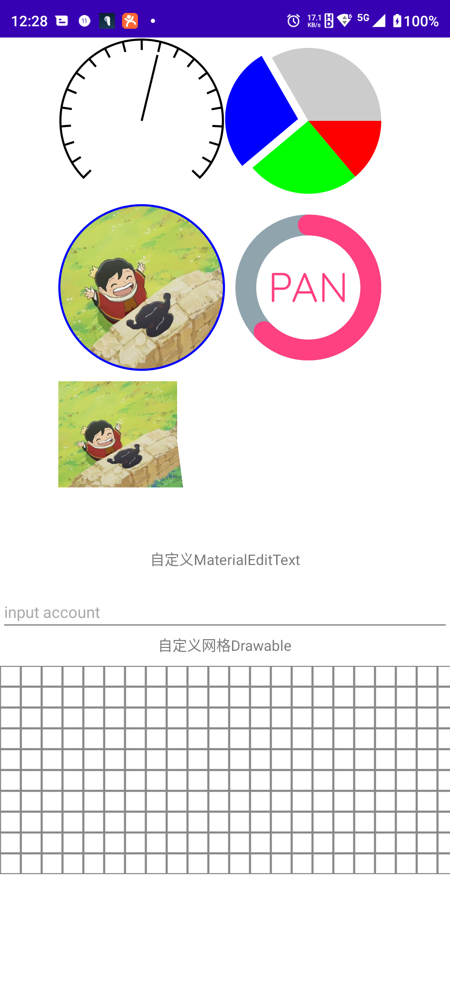
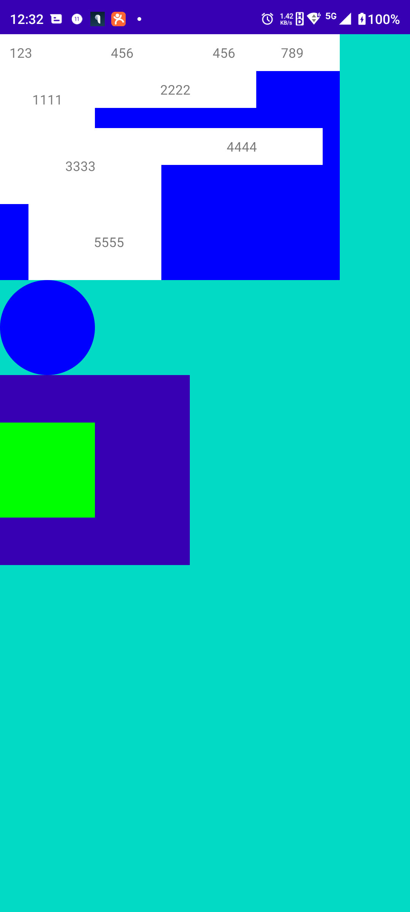

## 截图

<table>
    <tr>
        <td align="center">
            
             
            <b>主界面展示</b>
        </td>
        <td align="center">
            
             
            <b>自定义View列表</b>
        </td>
        <td align="center">
            
             
            <b>View展示</b>
        </td>
    </tr>
    <tr>
        <td align="center">
            
             
            <b>flow layout</b>
        </td>
        <td align="center">
            
             
            <b>GpuImage图片滤镜</b>
        </td>
                <td align="center">
            
             
            <b>compose list with paging</b>
        </td>

    </tr>

</table>

---

## APK

- [下载 APK](https://github.com/PanPersonalProject/Android_Learning/releases)

## 开发环境

- **IDE**：Android Studio Koala Feature Drop | 2024.1.2 Canary 8
- **minSdk**：24

---
